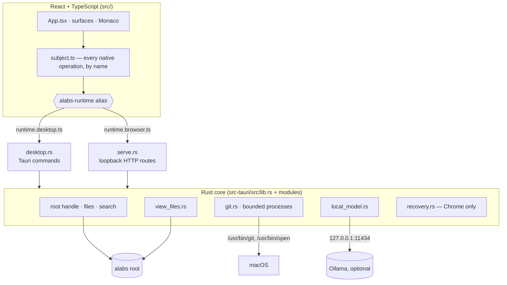

# Architecture

`alabs` is a workspace for people who work with code but aren't engineers. This document explains how it is built: what runs, how the pieces connect, where the boundaries are, and what can fail.

- What alabs is for: [what-is-alabs.md](what-is-alabs.md)
- How design questions are decided: [PRINCIPLES.md](PRINCIPLES.md)

Engineers reading the code: the alabs root is called the **subject** there (`SubjectRoot` in Rust, `subject.ts` in the frontend), and a work folder is called a **place**.

## Overview

alabs has one Rust core with two thin front doors: Tauri for the desktop app, and loopback HTTP for Chrome. Both run the same React frontend.



A build-time alias in `vite.config.ts` decides which runtime the frontend talks to.

## Repository layout

| Path | What it is |
| --- | --- |
| `src/` | The React/TypeScript frontend. Pure logic modules (`places.ts`, `tabs.ts`, `viewMap.ts`, `viewEvidence.ts` and others) sit beside the components that use them, with Vitest tests alongside. |
| `src/subject.ts` | The one place where a native operation is named. |
| `src/runtime*.ts` | The `Bridge`/`Host` seam, with its desktop and browser implementations. |
| `src-tauri/src/lib.rs` | The core: root handle, file operations, search, app state and log. It has no Tauri dependency. |
| `src-tauri/src/git.rs` | Bounded child processes and the hardened Git helper. |
| `src-tauri/src/view_files.rs` | The work-folder inventory and the Visual View pair write. |
| `src-tauri/src/local_model.rs` | The Ollama transport. |
| `src-tauri/src/recovery.rs` | Draft records on disk (Chrome only). |
| `src-tauri/src/desktop.rs`, `main.rs` | The Tauri front door (`desktop` feature, the default). |
| `src-tauri/src/serve.rs`, `bin/alabs-serve.rs` | The HTTP front door (`serve` feature). It never links Tauri. |
| `scripts/browser.mjs` | Builds the browser bundle and `alabs-serve`, starts the server and opens Chrome. |
| `tests/browser/` | Playwright tests that drive real Chrome against a real `alabs-serve`. |
| `creatures/raven/CREATURE.md` | Raven's contract, bundled into the app at build time. |
| `views/alabs/` | A map of this repository, in the same format the app writes. |
| `context/`, `wiki/`, `definitions/` | Example knowledge folders. alabs reads these from the root you open, not from this repository. |
| `views/` | The example views folder. |

## The root boundary

Everything alabs does to your files goes through one open handle to the root. This is what keeps alabs inside the folder you chose.

When a root is opened, the core keeps one open directory handle to it:

- **Paths are resolved from the handle.** Every path from the frontend is relative to the root and is resolved one component at a time from that handle, using `cap-std`. A path is never checked as a string and then reopened by name.
- **Escapes fail.** `..`, absolute paths, and symlinks that leave the root fail when they are resolved.
- **Symlinks inside the root are followed.** Saving through one writes to its target file.

Work folders are prefixes inside that one handle, not separate handles. `places.ts` decides which children of the root are work folders: every folder directly inside the root, except the knowledge folders, `views/`, dot-folders and symlinks.

Each open root has a **session number**. Long operations (Raven, Ask and map writes) capture it when they start and check it at every step. Switching roots changes the number, so a late result can never land in a different root. This holds even when the same path is reopened.

## Desktop and Chrome

Both runtimes share the same core. They differ only where the host itself differs:

| | Desktop (`npm run tauri dev`) | Chrome (`npm run browser -- <root>`) |
| --- | --- | --- |
| Transport | Tauri IPC commands | `POST /api/v1/<route>` on `127.0.0.1:43821` |
| Root | Chosen in the app, and can change | Fixed per process, from the command line |
| Move, rename, Delete to Trash | Yes | Refused, with an explanation |
| Unsaved-draft recovery | No (the window owns its buffers) | Yes (IndexedDB and disk) |
| Windows | One | Many, but only one may edit |
| Git | Standard | Adds `--no-optional-locks` |
| App state folder | `~/Library/Application Support/me.dannysheehan.alabs/` | `~/Library/Application Support/alabs-browser/` |

Everything else runs the same core code in both: file reads and saves, search, Git queries, Terminal, Raven, Ask and map writes.

The two state folders are separate, so neither runtime can overwrite the other's state. You can use a root in one runtime and then the other, with nothing to convert.

### Chrome's request boundary

A local web server is reachable by anything on the machine that can make an HTTP request. These rules make sure only the alabs page can use it.

`alabs-serve` binds exactly `127.0.0.1:43821`. If the port is taken, it refuses to start.

Each launch generates a random 32-byte credential. The page receives it once, in the URL fragment, and moves it into session storage.

Every `/api/v1/` request must do all of the following, or it is refused before any operation runs:

- carry the credential in a custom header;
- arrive with exactly the expected `Host`;
- arrive with exactly the expected `Origin`.

Each operation has its own named route. No route takes a command name.

The only files served as web content are the built assets in `dist-browser/`. Nothing in the root is served. User files arrive as JSON data.

Requests are bounded: a body of at most 16 MB, at most 16 requests at once, and at most 4 search walks at once.

### One window edits

Several Chrome windows can open the same root, but only one holds the writing role. The others open read-only and offer an explicit `Take over editing`.

The server enforces the role:

- Every change holds a shared gate while it writes to disk.
- A takeover takes that gate exclusively, so a save that is already running finishes first.
- The old window is refused on its next write.

Holding the role never makes an out-of-date write acceptable. The file-stamp check (see [Save](#save)) still applies.

Each `alabs-serve` lifetime has its own `serverId`, so a page can tell a restarted server from the one it was talking to.

### Draft recovery (Chrome)

A browser tab can close or crash at any time. Drafts make sure unsaved edits survive that.

When a buffer differs from its file, it becomes a numbered draft. A draft records the root, the path, the file stamp it was based on, the text and a revision number.

Each revision is written to two places:

- IndexedDB, through Dexie;
- `alabs-browser/recovery/`: one folder with 0700 permissions, holding 0600 records written by a staged rename.

The rules:

- A revision counts as saved only after a store has accepted it. A late write can only confirm its own revision.
- A store that fails says so and offers a copy of the text.
- A record is removed only after the file is confirmed saved at that revision, or after the user discards it.
- At the size budget (2 MB per draft, 64 MB in total), new writes are refused. Old drafts are never evicted to make room.

Drafts found at launch are offered, never applied automatically. Restoring one is a single edit that can be undone, and nothing is written until the user saves.

## Data flows

Each flow below follows one action from click to disk and back.

### Read

```text
click file
  → subject.readFile(rel)
  → bridge
  → core: resolve through the root handle,
          require a regular file of 2 MB or less, read it,
          return the text and its stamp
  → the tab opens in Monaco or Markdown
```

A **stamp** identifies the file's version on disk. The tab keeps it, and Save uses it to detect outside changes.

### Save

A save either lands completely or changes nothing. It never overwrites a change it hasn't seen.

```text
Cmd-S → saveFile(rel, text, stamp) → core:
  open the target through the handle;
    require the same inode, and a stamp equal to the expected one
  write the text to a 0600 temporary file beside it,
    copy the permissions, fsync
  commit with one atomic RENAME_SWAP
  check the displaced file is the one validated → unlink it
    otherwise swap back and return a conflict
→ a new stamp, or an error shown on the tab (the edits stay in the buffer)
```

If something outside alabs changes the file before the commit, the save fails and the outside change is kept. Neither side is lost silently.

Save never recreates a missing file. `Recreate` is a separate, explicit action. It uses a rename that refuses to replace an existing file.

**Known limit:** a process that already holds the old file open can keep writing to it after the swap.

In Chrome, a save that gets no answer is never retried. The page reads the file's stamp back instead:

| Stamp after | Meaning |
| --- | --- |
| Unchanged | The save did not happen. |
| Changed | The outcome is uncertain, so the tab waits for Refresh. |
| Gone | The tab is marked missing. |

The draft is kept in every case.

### Refresh

alabs does not watch the disk. Refresh is the only way it looks again.

Refresh does the following, in order:

1. Re-lists the root: its work folders, its knowledge folders, and which maps exist.
2. Re-reads the open work folder's tree and Overview.
3. Checks every open editor tab against the disk:
   - a tab with no unsaved edits whose file changed is reloaded;
   - a tab with unsaved edits whose file changed is marked **conflict** and left alone;
   - a tab whose file is gone is marked **missing**.

Inactive folders are not listed, and nothing is scanned. Refresh is skipped while a save is running, and it never starts Raven.

### Search

Search runs only when the user asks. The core walks one work folder from the root handle:

- It skips paths that `.gitignore` excludes, and files over 2 MB.
- It matches literal text only.
- It returns at most 1,000 hits, with each line cut at 200 characters.

Hits stream to the page in batches: as native events on the desktop, or as newline-delimited JSON on the same response in Chrome. A new search cancels the previous one. Nothing is indexed or kept between searches.

### Git and Changes

A repository can contain configuration that makes Git run code. alabs reads Git state without letting the repository run anything.

`git.rs` runs `/usr/bin/git` through `run_bounded`. Each run has a fixed program path and a 5-second deadline, and stdout is capped at 2 MB. If a run breaks either limit, the child process is killed.

Before a run, two things must be true:

- The work folder's `.git` is a real directory. If `.git` is a file, the work folder is reported as *linked* and is not inspected.
- `.git/info/attributes` does not exist.

Every call uses a fixed argument list that:

- disables hooks, fsmonitor, the pager, external diff, lazy fetch and attribute files;
- strips inherited `GIT_*` environment variables;
- closes stdin.

Revisions are accepted only as `HEAD` or a full hash, and paths only as plain relative paths, so no argument can be read as an option.

Changes compares against a baseline recorded when a task packet is copied, so it shows what changed after a handoff.

### Markdown and SVG rendering

Files in the root can contain HTML and scripts. Both formats pass through two stages before they reach the page.

**Markdown:**

1. `marked` renders the file with raw HTML dropped and images replaced by their alt text. Relative links become internal `data-path` links. Every other link becomes plain text.
2. DOMPurify cleans the result with an allowlist of text-only tags and one attribute.

**SVG:**

1. DOMPurify cleans the file with an allowlist of drawing elements. Scripts, styles, `foreignObject`, images and links are all removed.
2. A second pass keeps only fragment `href`s and local `url(#…)` references.

In both, clicking a path goes through the same `openPath` function and the same core resolver.

The desktop webview also runs under a Content Security Policy (CSP) that sets `script-src 'self'`, `object-src 'none'` and `frame-src 'none'` (`src-tauri/tauri.conf.json`).

### Terminal and task packets

These are the two ways work leaves alabs for another tool.

`Open in Terminal` runs `/usr/bin/open -a Terminal <path>` through the same bounded helper, with the path read back from the root handle. **Terminal then has normal user permissions, and alabs cannot confine it.**

A task packet is plain text (the task, constraints and chosen open files) copied to the clipboard. The task draft lives only in memory for the session and is never written to disk.

## Visual Views

A Visual View is two ordinary files. You can open the map without alabs.

```text
views/<work folder>/map.svg     the drawing; opens in any browser
views/<work folder>/view.json   the checked facts it was drawn from
views/.root/                    the Home map of the whole root
```

Opening a view needs only `map.svg`. The renderer reads landmarks from `<g data-landmark data-path>` groups.

`view.json` is versioned and bounded: at most 10 groups, 25 landmarks and 40 connections (see `viewMap.ts`).

**The pair write** (`view_files.rs`):

1. Both files are written as 0600 temporary files.
2. `map.svg` goes into place first. Any old map is swapped out and held at the temporary name.
3. `view.json` goes into place.
4. If step 3 fails, the old map is swapped back.

A write first checks that the root session still matches. In Chrome, it also checks that the window still holds the writing role.

**Not covered:** a crash between the two renames.

## Raven

Raven is the only creature. It builds a Visual View by asking a local model to explore a work folder, then keeps only what the files prove.

Raven's contract is `creatures/raven/CREATURE.md`, bundled into the app at build time. The code reads only its `name`, `job` and `model` (currently `qwen3.5:9b`). To change the model, edit that file and rebuild.

The workflow lives in `viewBuild.ts` and `viewEvidence.ts`. The frontend runs it through ordinary bridge calls, so Raven works the same way on the desktop and in Chrome.

```mermaid
sequenceDiagram
  participant U as User
  participant F as Frontend (viewBuild)
  participant C as Rust core
  participant O as Ollama
  U->>F: Run Raven
  F->>C: view_session, collect_inventory
  F->>C: read README + manifests
  loop up to 12 actions
    F->>O: evidence + notes so far (generate JSON)
    O-->>F: {list | search | read} or the map
    F->>C: perform the action (bounded)
  end
  F->>F: validate: paths exist, anchors occur; render SVG; sanitize
  F->>C: write_view_files (staged pair)
```

Every run has fixed limits:

| Limit | Value |
| --- | --- |
| Inventory entries shown | 300 |
| Inventory walk | 5,000 entries visited, depth 8; dependency, build and version-control folders skipped |
| Starting files read | 6 |
| Characters per read | 3,000 |
| Files never read | over 512 KB, or not text by extension |
| Actions | 12 |
| Notes | 32,000 characters |
| Per action | 40 search hits, 200 listing lines |

**Private environment files.** Files named `.env`, `.env.*` or `*.env` appear by name, but their contents never enter the evidence, whether through a read, a search hit or an anchor check. **No other filename gets this treatment.** Any other text file in the work folder can be sent to the local model.

**The model's answer is a proposal.** Before rendering, alabs drops landmarks that cite paths which don't exist, and connections whose cited text doesn't occur. If any stage fails, the old map stays in place.

**The Home map.** Started from Home, Raven builds the root map from what alabs already has for each work folder: its checked view if it has one, otherwise its README title and top-level entries. The Home map shows containment only.

Only one Raven run happens at a time. Navigation continues while it runs, and switching roots cancels it.

## Local model transport

alabs talks to exactly one model server, on your machine, and only when you ask.

`local_model.rs` speaks HTTP/1.0 over a raw `TcpStream` to `127.0.0.1:11434`, and to nothing else.

| Call | When | Limits |
| --- | --- | --- |
| `list_local_models` (`GET /api/tags`) | An explicit choose or change click | 10 s |
| `ask_local_model` (`POST /api/generate`) | An explicit Ask | 2 s to connect, 120 s total, `num_ctx` 8192 |
| `generate_local_model_json` | Each Raven step | 2 s to connect, 600 s total, `num_ctx` 16384, `format: json`, temperature 0.2 |

Every call:

- sends at most 128 KB of input and accepts at most a 1 MB response;
- uses no streaming, no retries, and `think: false`;
- names a model that must match one Ollama listed at that moment.

Nothing is logged except the kind of failure. If Ollama refuses the connection, the result is "unavailable". alabs never starts Ollama.

**Ask** sends three things: a fixed instruction, the question, and the top-level `.md`, `.markdown` and `.txt` files of `context/` and `wiki/`. It does not include subfolders or files from any work folder. If the material is over 24,000 characters, the ask fails and says so. There is no retrieval or ranking step.

## Application state

alabs keeps a small amount of its own state outside the root:

| File | Contents | Safe to delete |
| --- | --- | --- |
| `ui-state.json` | The root path (desktop), open work folders and tabs, cursor positions, the chosen Ask model, Git baselines. At most 1 MB. | Yes |
| `alabs.log`, `alabs.log.1` | Event names and failure reasons, with the root path redacted and never any file contents. At most 1 MB, rotated once. | Yes |
| `recovery/` (Chrome only) | Unsaved drafts | **No** |

## Failure behavior

A failure stays with the action that caused it. A model error belongs to Raven or Ask, a Git error to the Git facts, and a failed read to that tab. Only an unavailable root disables the whole app.

| Situation | Result |
| --- | --- |
| File changed on disk before the save | Save refused as a conflict; the buffer is kept |
| File gone at save time | Tab marked missing; Recreate is a separate choice |
| Save unanswered (Chrome) | The file is read back; never retried; the draft is kept |
| Draft store fails (Chrome) | Shown as not kept; a copy of the text is offered |
| Ollama down, or model missing | Raven or Ask says so; nothing else changes |
| Map fails validation or the write | The old pair is unchanged |
| Root switched during Raven or Ask | Later steps and results are discarded |
| Git is slow or its output is huge | A named timeout, or "too large" |
| Delete across volumes | Refused, not copied |

## Security boundaries

alabs is a single-user local app, not a sandbox.

The trust line runs between **content in the root** and **the core**:

- **Content in the root is untrusted:** code, configuration, Markdown, SVG and Git data. It can be read, rendered through sanitizers, and sent to a local model when the user asks. It can never cause execution.
- **The core is trusted.**

Outside the root, alabs touches only:

- its own state folder;
- `~/.Trash`, for desktop Delete. The Trash must be owned by the user, and the item must be on the same volume;
- Terminal.app, when asked;
- Ollama on loopback, when asked.

The Chrome server accepts only credentialed, same-origin requests on loopback. Beyond that, alabs does not defend against other processes running as the same user.

## Not in the architecture

There is no hosted backend, no accounts, no sync, no telemetry, no file watcher, no search index, no plugin system, no general agent runtime, and no automatic execution of anything in the root.

alabs is macOS only. The core uses `renameatx_np` and `~/.Trash`, and it refuses to compile on any other platform.
