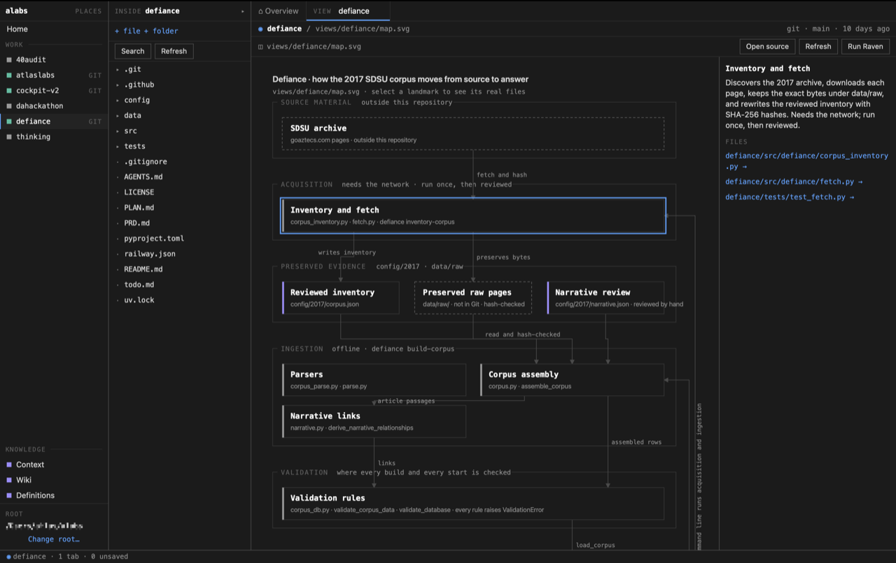

# alabs

alabs is a local macOS workspace for understanding the engineering environment around your software, and for working on that software in the same place.

alabs is for people who can build working software, often with AI coding tools, but who do not fully understand the files, configuration, Git state and connections that make it work. I built it for myself first. I am one of those people.

alabs does not hide the real project behind a new format. You work on the real files, in the real folders. alabs adds ways to see what is there: facts about each folder, rendered documentation, Git changes, and saved maps whose every box points to real files.

I built alabs to help close that gap for myself. I wanted a workspace that could show me what exists, help explain how the pieces connect, and still let me work in the real repository instead of hiding it behind another system.

## What it does

You choose one folder, the **alabs root**. Each folder inside it is a **work folder**, which can be a repository or any ordinary folder. All project file access is bounded to that root.



|  | |
| - | - |
| **Home** | Every work folder and knowledge folder in the root, and a map of the root once one is built. |
| **Overview** | Facts about one work folder: its README, top-level entries, Git branch and last commit, and whether it has a Visual View. Nothing is inferred from names. |
| **Files and editor** | The real folder tree, with Monaco editing the real file. A save that fails is reported as failed. |
| **Markdown** | Rendered beside its source, with raw HTML, scripts and images removed. |
| **Search** | Literal search inside one work folder, on request, respecting .gitignore. There is no index. |
| **Changes** | Git status and per-file comparisons, read without running anything in the repository. |
| **Visual Views** | A saved map of a work folder (map.svg plus view.json). Select a landmark to open its files. |
| **Knowledge** | [Context](context/), [Wiki](wiki/) and [Definitions](definitions/): **ordinary** folders you can reach from any work folder. |
| **Task packet, Terminal** | Copy a plain-text task with chosen files for another coding tool, or open a work folder in Terminal. |
| **Raven** (optional model) | An explicit Run Raven builds or rebuilds a Visual View using a local Ollama model. |
| **Ask local model** (optional model) | On the Wiki Overview, ask a question about the text files in [context](context/) and [wiki](wiki/). |


## Try it

`alabs` runs on macOS only and is built from source. There is no signed download. The versions below are what it was tested on, not minimum requirements.

| What's needed | What's been tested |
| - | - |
| macOS | 26.6 on Apple Silicon |
| Node.js | 26.8.1 |
| npm | 11.19.0 |
| Rust | 1.98.1 |
| Xcode Command Line Tools (provides `git`) | 27.0 |
| Google Chrome | Browser runtime only |
| *Ollama* | *Optional* |

Get the source:

```bash
git clone https://github.com/dan-sheehan/alabs.git
```

Move into it:

```bash
cd alabs
```

Install the exact dependency versions in `package-lock.json`:

```bash
npm ci
```

Run it in development mode. The first run compiles the Rust side and takes **a few minutes**:

```bash
npm run tauri dev
```

### On first launch

alabs asks you to choose your **alabs root**. Pick a folder that *holds* projects, not a project itself. A new empty folder is the safest choice. Clone or move projects into it.

**Do not pick a single project.** If you do, each of its subfolders becomes a work folder.

alabs does not watch the disk. If something changes outside the app, click `Refresh`.

To build an unsigned `alabs.app`, which lands in `src-tauri/target/release/bundle/macos/`:

```bash
npm run tauri build
```

### In Chrome instead

The same interface runs in Google Chrome. A local server owns one root:

```bash
npm run browser -- "/absolute/path/to/your/alabs-root"
```

This builds the browser bundle and the `alabs-serve` binary, starts the server on `127.0.0.1:43821`, and opens Chrome. Control-C stops it. Closing Chrome does not.

Chrome does everything above except **move, rename and delete**. Those controls tell you so: do it in Finder, then click `Refresh`. Chrome also keeps unsaved edits as recoverable drafts. Details are in [ARCHITECTURE.md](ARCHITECTURE.md#desktop-and-chrome).

### Optional: a local model

Only [Raven](creatures/raven/CREATURE.md) and Ask need a model. Both talk to [Ollama](https://ollama.com) at `127.0.0.1:11434`. alabs never installs or starts Ollama.

Raven uses the model named in its [CREATURE.md](creatures/raven/CREATURE.md):

```bash
ollama pull qwen3.5:9b
```

Ask uses whichever installed model you pick in the app.

### Checks

Frontend tests:

```bash
npm test
```

Rust tests:

```bash
cargo test --manifest-path src-tauri/Cargo.toml
```

Type check and build:

```bash
npm run build
```

End-to-end tests in Chrome. Google Chrome must be installed. This command builds the browser assets and server first; stop any running alabs browser server so the tests can use port `43821`:

```bash
npm run test:browser
```

## What it touches

- **Inside the root:** alabs reads files, and writes only after you act. The Rust side refuses any path that leaves the root.
- **App data:** `~/Library/Application Support/me.dannysheehan.alabs/` for the desktop app, or `~/Library/Application Support/alabs-browser/` for Chrome. These hold the remembered layout and a small log. The Chrome folder also holds `recovery/`, which is **your unsaved work. Do not delete it.**
- **The macOS Trash:** Delete on the desktop moves files there. Nothing is permanently deleted.
- **Terminal.app:** only when you click `Open in Terminal`. Terminal then has its normal permissions.
- **Ollama on loopback:** only when you start Raven or Ask.

No accounts. No cloud sync. No telemetry. No hosted backend.

## Limits

- This is early software, built for my own use first. Expect rough edges.
- macOS only, from source only. The browser version supports Chrome only.
- Chrome cannot move, rename or delete yet. Draft recovery exists only in Chrome.
- Files over 2 MB do not open in the editor and are not searched.
- Each Git call is limited to five seconds and 2 MB of output. A very large repository may report that there is too much to show.
- A work folder whose `.git` is a file (a worktree or submodule) is shown as linked and is not inspected.
- A map is only as good as its evidence. Raven leaves out what it cannot prove, so a map can be thin.

## Learn more

- [what-is-alabs.md](what-is-alabs.md): what alabs is for, what it is not, and its vocabulary.
- [PRINCIPLES.md](PRINCIPLES.md): the rules that decide design questions.
- [ARCHITECTURE.md](ARCHITECTURE.md): how it works, where the boundaries are, and what can fail.
- [docs/design.md](docs/design.md): the visual and written language.
- [creatures/](creatures/README.md), [views/](views/README.md), [definitions/](definitions/README.md): the creature contract, the Visual View format and the glossary.

## Contributing and reporting

Use GitHub Issues for bugs. Do not include credentials, keys or private file contents. Report security problems through GitHub's private vulnerability reporting. If a document says alabs does something the source does not do, that is a bug.

Pull requests are judged against [what-is-alabs.md](what-is-alabs.md) and [PRINCIPLES.md](PRINCIPLES.md). Small changes that keep alabs local and file-first have the best chance.

## License

- **Source code:** MIT. See [LICENSE](LICENSE).
- **Bundled third-party components:** listed in [THIRD_PARTY_NOTICES.md](THIRD_PARTY_NOTICES.md).
- **Screenshots and artwork:** not covered by the source license. See [assets/screenshots/README.md](assets/screenshots/README.md).
